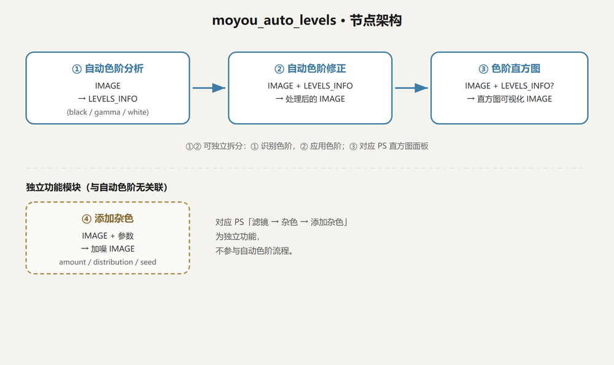
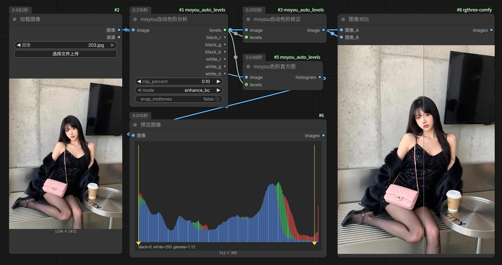
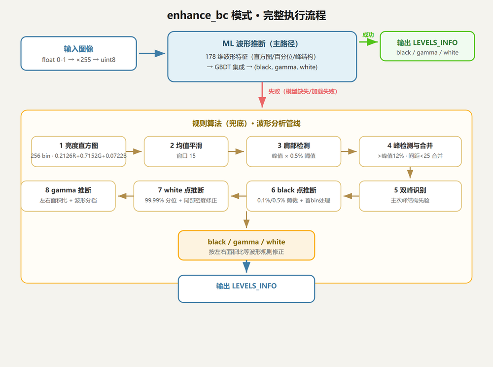
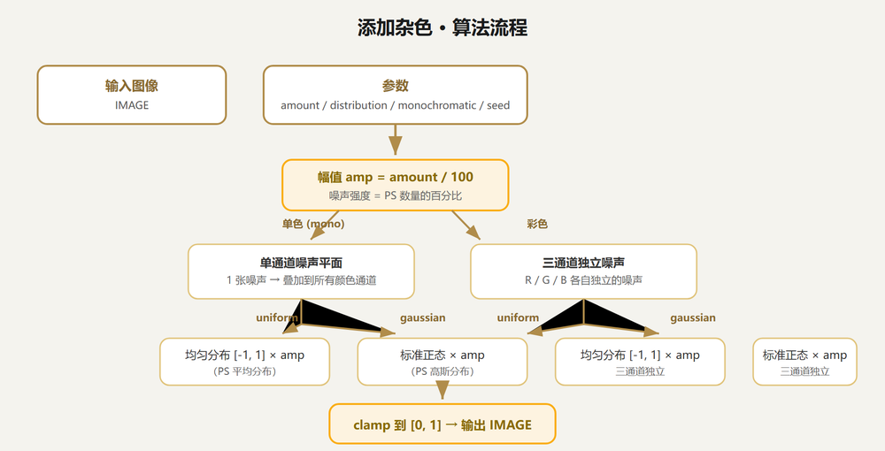

# moyou\_auto\_levels

ComfyUI 插件，提供两组相互独立的功能：


* **自动色阶**：实现「增强亮度和对比度」风格的自动色阶调整（分析 / 修正 / 直方图三个节点）

* **添加杂色**：实现「滤镜 → 杂色 → 添加杂色」类型功能（独立节点）




## 示例工作流

以下为节点部署示例：加载图像 → 自动色阶分析 → 自动色阶修正 → 色阶直方图 / 图像对比。



***

## 一、自动色阶

### 1.1 节点说明


| 节点               | 输入                     | 输出                                                                 |
| ---------------- | ---------------------- | ------------------------------------------------------------------ |
| **moyou 自动色阶分析** | IMAGE                  | LEVELS\_INFO（black /gamma/white）+ 6 个数值（black\_r/g/b、white\_r/g/b） |
| **moyou 自动色阶修正** | IMAGE + LEVELS\_INFO   | 处理后的 IMAGE                                                         |
| **moyou 色阶直方图**  | IMAGE（可选 LEVELS\_INFO） | 直方图可视化 IMAGE                                                       |

分析节点负责「识别色阶」，修正节点负责「应用色阶」，可独立使用、自由组合。

### 1.2 分析节点参数


| 参数             | 默认值         | 说明                 |
| -------------- | ----------- | ------------------ |
| image          | —           | 输入图像（0-1 浮点张量）     |
| clip\_percent  | 0.10%       | 剪裁百分比（默认 0.10%） |
| mode           | enhance\_bc | 处理模式，见下表           |
| snap\_midtones | false       | 对齐中性中间调（可选） |

### 1.3 四种模式


| 模式                  | 算法                     | black /white 来源           |
| ------------------- | ---------------------- | ------------------------- |
| **enhance\_bc**（默认） | ML 波形推断（主路径）→ 失败回退规则算法 | ML 直接预测 / 规则直方图形状推断       |
| per\_channel        | 逐通道累积剪裁                | 每通道各自 0.1% 低位 / 高位剪裁点     |
| monochromatic       | 灰度累积剪裁                 | 灰度图（0.299/0.587/0.114）剪裁点 |
| find\_dark\_light   | 找最暗 / 最亮像素             | 按亮度取最暗 / 最亮 k 个像素的 RGB 均值 |

### 1.4 enhance\_bc 算法逻辑





* **ML 波形推断（主路径）**：从图像提取 178 维波形特征（直方图分布、百分位、统计量、峰结构等，波形为主）→ GBDT 集成 → 直接预测 (black, gamma, white)

* **规则算法（兜底）**：ML 不可用（模型缺失 / 加载失败 / 预测异常）时启用 —— 亮度直方图 → 平滑 → 肩部检测 → 峰检测合并 → 双峰识别 → black /white/gamma 推断

### 1.5 修正节点应用公式


```
v' = clamp( (v − b/255) / (w/255 − b/255), 0, 1 )   ← 线性重映射

v'' = v' ^ (1/gamma)                                 ← gamma 校正（≈1 时跳过）
```

与标准色阶公式一致：black/white 决定黑场 / 白场剪裁与拉伸，gamma 决定中间调曲线。

### 1.6 模型能力

达标标准：black /white 与实测真值差值 ≤ 5，gamma 差值 ≤ 0.05。


| 参数    | 平均误差   | 最大误差 | 达标率  |
| ----- | ------ | ---- | ---- |
| black | 0.02   | 1.0  | 100% |
| gamma | 0.0003 | 0.04 | 100% |
| white | 0.03   | 3.0  | 100% |

> 泛化边界：已见样本全部达标；对全新图片仍可能存在少量残余差异，主要集中在少数参数区间。补充对应类型的样本并重训，可进一步提升泛化能力。


***

## 二、添加杂色（独立功能）

与自动色阶无关联，对应「滤镜 → 杂色 → 添加杂色」类型功能。

### 2.1 节点说明

**moyou 添加杂色**


| 参数            | 默认值     | 说明                                |
| ------------- | ------- | --------------------------------- |
| image         | —       | 输入图像                              |
| amount        | 9.0     | 杂色数量（0.1-400）              |
| distribution  | uniform | 分布方式：uniform（平均分布）/gaussian（高斯分布） |
| monochromatic | true    | 单色（灰度杂色）/ 彩色（RGB 独立杂色）            |
| seed          | 0       | 随机种子（可复现）                         |

### 2.2 算法逻辑





```
幅值 amp = amount / 100

单色模式：生成 1 通道噪声平面 → 叠加到所有颜色通道

彩色模式：生成 3 通道独立噪声 → 分别叠加到 R/G/B

分布：

&#x20; uniform  → 均匀分布 \[-1, 1] × amp

&#x20; gaussian → 标准正态 × amp

输出前整体 clamp 到 \[0, 1]
```


***

## 三、安装与使用


1. 将 `comfyui_moyou_auto_levels` 文件夹复制到 `ComfyUI/custom_nodes/` 下

2. 首次启动 ComfyUI 时自动安装依赖（`requirements.txt`，即 scikit-learn）

3. 完全重启 ComfyUI 后，节点出现在 `moyou/image` 分类中

### 文件结构


```
moyou\_auto\_levels/

├── nodes.py                 # 节点定义（4 个节点）

├── ml\_predict.py            # ML 波形推断（特征提取 + 模型推理）

├── models/

│   └── auto\_levels\_model.pkl  # 训练好的模型

├── docs/

│   ├── arch.png             # 节点架构图

│   ├── flow\_enhance.png     # enhance\_bc 执行流程图

│   ├── flow\_noise.png       # 添加杂色流程图

│   └── workflow.jpg         # 节点部署示例图

├── requirements.txt

├── README.md

└── algo\_flow\_full.html      # 算法逻辑可视化文档
```